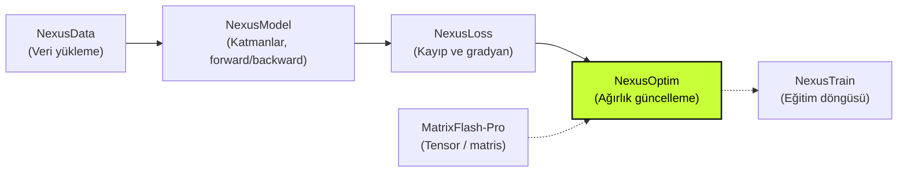
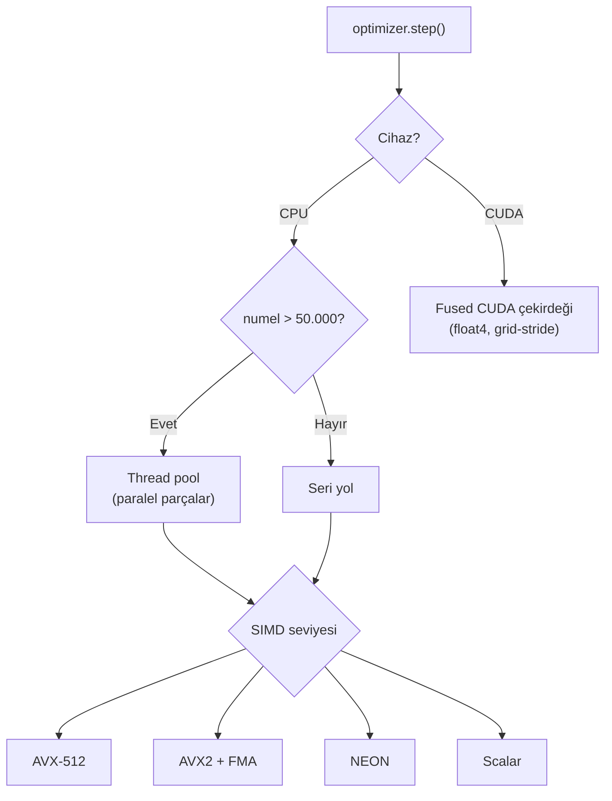

# ⚡ NexusOptim

> **Yüksek performanslı C++20 optimizer kütüphanesi: 14 optimizer, 7 öğrenme hızı zamanlayıcısı, AVX2 / AVX-512 / NEON SIMD, fused CUDA çekirdekleri ve FP16/BF16 karma hassasiyet desteği.**

[](https://en.cppreference.com/w/cpp/20)
[](CMakeLists.txt)
[](#-cuda-ve-matrixflash-pro)
[](#-performans-mimarisi-ve-yapılan-optimizasyonlar)
[](#-testler-ve-doğrulama)

<p align="center">
  
  
  
  
</p>

---

## 📌 Genel bakış

**NexusOptim**, makine öğrenmesi eğitim döngülerinde **parametre güncelleme** işini yapan, sıfırdan C++20 ile yazılmış bir optimizasyon kütüphanesidir. Geri yayılımdan (backward) gelen gradyanları alır ve seçtiğiniz algoritmayla (SGD, Adam, AdamW, LAMB, Lion vb.) model ağırlıklarını olabildiğince hızlı ve doğru biçimde günceller.

Kütüphane şunları yönetir:

- 🧮 **Parametre güncellemesi:** 14 optimizer algoritması ve Lookahead sarmalayıcısı,
- 📉 **Öğrenme hızı planlaması:** StepLR'den OneCycleLR'e kadar 7 zamanlayıcı,
- ✂️ **Gradyan işleme:** kırpma, ölçekleme, birikim ve gradient centralization,
- 💾 **Optimizer durumu:** moment tamponları, `state_dict()` / `load_state_dict()`,
- 🚀 **Donanım hızlandırma:** çalışma zamanında seçilen SIMD yolu, thread pool ve opsiyonel CUDA.

NexusOptim bir tensor, model, loss veya veri yükleme kütüphanesi **değildir**. Matris işlemleri, ileri/geri yayılım ve loss hesabı ekosistemin diğer bileşenlerine bırakılır; NexusOptim'in tek işi, hesaplanmış gradyanları parametrelere en verimli şekilde uygulamaktır.

### 🧩 Nexus ekosistemindeki yeri



| Bilgi | Değer |
|---|---|
| Sürüm | `1.0.0` |
| Dil / standart | C++20 |
| Derleme sistemi | CMake 3.20+ |
| Namespace | `nexus_optim` |
| CMake hedefi | `nexus_optim::nexus_optim` |
| Umbrella header | `#include <nexus_optim/nexus_optim.hpp>` |
| Çalışma zamanı bağımlılığı | Yok (yalnızca C++ standart kütüphanesi; CUDA opsiyonel) |

---

## 📑 İçindekiler

- [Genel bakış](#-genel-bakış)
- [Ne işe yarar? (Özellikler)](#-ne-işe-yarar-özellikler)
- [Kullanılan teknolojiler ve bağımlılıklar](#-kullanılan-teknolojiler-ve-bağımlılıklar)
- [Performans mimarisi ve yapılan optimizasyonlar](#-performans-mimarisi-ve-yapılan-optimizasyonlar)
- [Kurulum ve derleme](#-kurulum-ve-derleme)
- [Hızlı başlangıç ve kullanım örnekleri](#-hızlı-başlangıç-ve-kullanım-örnekleri)
- [Parametre grupları](#-parametre-grupları)
- [Optimizer kataloğu](#-optimizer-kataloğu)
- [Öğrenme hızı zamanlayıcıları](#-öğrenme-hızı-zamanlayıcıları)
- [Gradyan işleme](#️-gradyan-işleme)
- [Düşük hassasiyet ve durum yönetimi](#-düşük-hassasiyet-ve-durum-yönetimi)
- [CUDA ve MatrixFlash-Pro](#-cuda-ve-matrixflash-pro)
- [Benchmark sonuçları](#-benchmark-sonuçları)
- [Testler ve doğrulama](#-testler-ve-doğrulama)
- [Dokümantasyon](#-dokümantasyon)
- [Proje dizin yapısı](#️-proje-dizin-yapısı)
- [Sınırlamalar](#️-sınırlamalar)
- [Geliştirici](#-geliştirici)

---

## ✨ Ne işe yarar? (Özellikler)

| Alan | Özellik |
|---|---|
| **Optimizer'lar** | SGD, Momentum SGD, Nesterov SGD, Adagrad, RMSProp, Adadelta, Adam, AdamW, NAdam, RAdam, AdaBelief, LAMB, LARS, Lion |
| **Sarmalayıcı** | Her optimizer ile kullanılabilen `Lookahead<Inner>` |
| **Zamanlayıcılar** | StepLR, ExponentialLR, CosineAnnealingLR, CosineAnnealingWarmRestarts, OneCycleLR, LinearWarmup, ReduceLROnPlateau |
| **Gradyan işleme** | Global norm kırpma (L1/L2/L∞), değer kırpma, gradyan ölçekleme / birikim, gradient centralization |
| **SIMD** | Scalar, AVX2+FMA, AVX-512, ARM NEON; CPUID ile çalışma zamanında otomatik seçim |
| **Paralellik** | Büyük tensörlerde thread pool ile paralel güncelleme, küçük tensörlerde seri yol |
| **GPU** | Fused CUDA çekirdekleri (SGD ailesi, Adam/AdamW, Lion, LAMB, LARS ve diğerleri) |
| **Karma hassasiyet** | `float16` / `bfloat16` depolama, FP32 master ağırlık ve FP32 momentler |
| **Durum yönetimi** | `state_dict()` / `load_state_dict()` ile checkpoint desteği |
| **Tasarım** | Borrowed-pointer (bellek sahibi model), CRTP ile sanal çağrısız `step()`, adım sırasında sıfır bellek tahsisi |

---

## 🧰 Kullanılan teknolojiler ve bağımlılıklar

NexusOptim'in çalışma zamanında hiçbir üçüncü parti bağımlılığı yoktur. Aşağıdaki tablo, kütüphanenin geliştirilmesinde ve derlenmesinde kullanılan tüm teknolojileri gösterir.

| Teknoloji | Nerede / neden kullanılıyor | Zorunlu mu? |
|---|---|:---:|
| **C++20** | Tüm kütüphane; CRTP şablonları, `if constexpr` ile derleme zamanı tip seçimi, `std::optional` | ✅ |
| **C++ standart kütüphanesi** | `std::thread`, `std::mutex`, `std::condition_variable`, `std::atomic` (thread pool), `std::chrono` (benchmark) | ✅ |
| **CMake 3.20+** | Derleme, test, kurulum (`install`) ve paket hedefleri | ✅ |
| **MSVC (Visual Studio 2022) / GCC / Clang** | Desteklenen derleyiciler; MSVC'de `/W4 /WX`, GCC/Clang'da `-Wall -Wextra -Wpedantic` | ✅ |
| **x86 SIMD intrinsics** (`<immintrin.h>`) | AVX2 + FMA ve AVX-512F fused optimizer çekirdekleri | Donanıma göre |
| **CPUID** | Çalışma zamanında işlemcinin desteklediği en hızlı SIMD yolunu seçmek | ✅ |
| **ARM NEON** (`<arm_neon.h>`) | ARM / Apple Silicon işlemcilerde vektörel çekirdekler | Donanıma göre |
| **NVIDIA CUDA Toolkit** (13.4 ile test edildi) | Fused GPU çekirdekleri, `float4` vektörel yükleme, CUDA stream'leri | ❌ Opsiyonel |
| **GoogleTest 1.14.0** | Birim testleri; CMake `FetchContent` ile otomatik indirilir | ❌ Yalnızca testler |
| **MatrixFlash-Pro** | `matrix_pro::Tensor` adapter'ı (`group_from_host`, `group_from_device`) | ❌ Opsiyonel |
| **PyTorch referans verisi** | `tests/reference/adam_step1.csv` ile sayısal doğrulama (çalışma zamanında gerekmez) | ❌ Yalnızca testler |

---

## 🚀 Performans mimarisi ve yapılan optimizasyonlar

NexusOptim'deki her tasarım kararı `optimizer.step()` sıcak yolunu hızlandırmak için alınmıştır:

| Optimizasyon | Açıklama |
|---|---|
| **Fused çekirdekler** | Weight decay, moment güncellemesi, bias düzeltmesi ve parametre güncellemesi tek geçişte yapılır; bellek yalnızca bir kez okunup yazılır. |
| **Çalışma zamanı SIMD dispatch** | CPUID ile AVX-512 → AVX2+FMA → NEON → scalar sırasıyla en iyi yol bir kez seçilir. Aynı ikili dosya farklı işlemcilerde güvenle çalışır. |
| **64 byte hizalı bellek** | Moment tamponları `AlignedBuffer` ile cache line'a hizalanır; hizalı vektör yükleme/yazma kullanılır. |
| **Sıfır tahsisli `step()`** | Tüm optimizer durumları constructor'da ayrılır; eğitim sırasında `new` / `malloc` çağrılmaz. |
| **CRTP tasarımı** | `OptimizerBase<Derived, T>` ile `step()` sanal çağrı içermez, derleyici çekirdekleri inline edebilir. |
| **Akıllı paralellik** | 50.000 elemandan büyük tensörler thread pool'a bölünür (64 eleman hizalı parçalar, spin-then-wait işçiler); küçük tensörlerde thread maliyetinden kaçınılır. |
| **Fused CUDA çekirdekleri** | `float4` vektörel erişim, grid-stride döngüler, SM × 32 grid sınırı, 4 non-blocking stream, LAMB/LARS için warp/block reduction. |
| **Karma hassasiyet** | FP16/BF16 depolamada hesaplar FP32 master kopya üzerinde yapılır; hassasiyet kaybı olmadan bellek yarıya iner. |



---

## 🔧 Kurulum ve derleme

### Gereksinimler

- C++20 destekli derleyici: **Visual Studio 2022 (MSVC)**, **GCC 11+** veya **Clang 14+**
- **CMake 3.20** veya üzeri
- *(Opsiyonel)* GPU desteği için **NVIDIA CUDA Toolkit** ve uyumlu sürücü
- *(Opsiyonel)* Testler için internet bağlantısı (GoogleTest otomatik indirilir)

### 1. Derleme (yalnızca CPU)

```bat
cd NexusOptim
cmake -S . -B build -DNEXUS_OPTIM_WITH_CUDA=OFF
cmake --build build --config Release --parallel
ctest --test-dir build -C Release --output-on-failure
```

### 2. Derleme (CUDA ile)

```bat
cmake -S . -B build-cuda -DNEXUS_OPTIM_WITH_CUDA=ON -DCMAKE_CUDA_ARCHITECTURES=86
cmake --build build-cuda --config Release --parallel
ctest --test-dir build-cuda -C Release --output-on-failure
```

`86`, RTX 30 serisi içindir. Kendi GPU'nuzun compute capability değerini kullanın (ör. RTX 40 serisi için `89`).

### 3. Sisteme kurulum

```bat
cmake --install build --config Release --prefix install
```

### 4. Kendi projenize dahil etme

```cmake
# Kaynak ağacından
add_subdirectory(path/to/NexusOptim)
target_link_libraries(my_app PRIVATE nexus_optim::nexus_optim)
```

### 5. CMake seçenekleri

| Seçenek | Varsayılan | Açıklama |
|---|:---:|---|
| `NEXUS_OPTIM_WITH_CUDA` | `OFF` | Fused CUDA optimizer çekirdeklerini derler |
| `NEXUS_OPTIM_BUILD_TESTS` | `ON` | GoogleTest testlerini derler |
| `NEXUS_OPTIM_BUILD_BENCHMARKS` | `ON` | Benchmark programlarını derler |
| `NEXUS_OPTIM_BUILD_EXAMPLES` | `ON` | Örnek uygulamaları derler |
| `NEXUS_OPTIM_ENABLE_AVX512` | `ON` | AVX-512 çeviri birimini derler (çalıştırma kararı runtime'da verilir) |
| `NEXUS_OPTIM_WARNINGS_AS_ERRORS` | `ON` | Uyarıları hata olarak ele alır |
| `NEXUS_MATRIXFLASH_INCLUDE` | boş | MatrixFlash-Pro `include/` dizini; verilirse adapter etkinleşir |
| `CMAKE_CUDA_ARCHITECTURES` | `86` | Hedef GPU mimarisi |

---

## ⚡ Hızlı başlangıç ve kullanım örnekleri

### 1. En basit SGD adımı

```cpp
#include <nexus_optim/nexus_optim.hpp>
#include <vector>

int main() {
  std::vector<float> params{1.f, 2.f, 3.f, 4.f};
  std::vector<float> grads{0.1f, -0.2f, 0.3f, -0.4f};

  nexus_optim::ParamGroupOptions group_options;
  group_options.learning_rate = 0.1;

  nexus_optim::SGD<float>::Options options;
  options.lr = 0.1;
  options.weight_decay = 1e-4;

  nexus_optim::SGD<float> optimizer(
      {nexus_optim::make_group(params.data(), grads.data(), params.size(), group_options)},
      options);

  optimizer.zero_grad();
  // Burada NexusModel forward/backward işlemleri grads'ı doldurur.
  optimizer.step();
}
```

### 2. AdamW + gradyan kırpma + cosine zamanlayıcı

```cpp
nexus_optim::ParamGroupOptions group;
group.learning_rate = 1e-3;

nexus_optim::AdamW<float>::Options adamw;
adamw.lr = 1e-3;
adamw.beta1 = 0.9;
adamw.beta2 = 0.999;
adamw.eps = 1e-8;
adamw.weight_decay = 0.01;

nexus_optim::AdamW<float> optimizer(
    {nexus_optim::make_group(params.data(), grads.data(), params.size(), group)}, adamw);
nexus_optim::CosineAnnealingLR scheduler(optimizer, /*t_max=*/1000);

for (int step = 0; step < 1000; ++step) {
  optimizer.zero_grad();
  // forward + loss + backward -> grads
  nexus_optim::clip_grad_norm_(optimizer.param_groups(), /*max_norm=*/1.0);
  optimizer.step();
  scheduler.step();
}
```

### 3. Lookahead sarmalayıcısı

```cpp
nexus_optim::SGD<float> inner({nexus_optim::make_group(p.data(), g.data(), p.size())}, sgd_options);
nexus_optim::Lookahead<nexus_optim::SGD<float>> optimizer(std::move(inner), /*k=*/5, /*alpha=*/0.5f);

optimizer.step();  // her 5 adımda yavaş ağırlıklar hızlı ağırlıklara yaklaştırılır
```

### 4. Gradient accumulation (büyük efektif batch)

```cpp
constexpr int kAccum = 4;
optimizer.zero_grad();
for (int micro = 0; micro < kAccum; ++micro) {
  // forward + backward: gradyanlar üst üste birikir
}
nexus_optim::scale_gradients_(optimizer.param_groups(), 1.0 / kAccum);
optimizer.step();
```

### 5. Hazır örnek programlar

| Program | Açıklama |
|---|---|
| `examples/basic_sgd_example.cpp` | En basit parametre/gradyan güncellemesi |
| `examples/train_loop_with_nexus_optim.cpp` | SGD + LinearWarmup ile `y = 3x + 1` doğrusal regresyonu |

---

## 👥 Parametre grupları

Bir `ParamGroup<ScalarT>` aynı hiperparametreleri paylaşan tensörleri paralel diziler hâlinde tutar:

| Alan | Açıklama |
|---|---|
| `params` | Parametre buffer pointer'ları (borrowed) |
| `grads` | Gradyan buffer pointer'ları (borrowed) |
| `numels` | Her buffer'daki eleman sayısı |
| `devices` | `Device::CPU` veya `Device::CUDA` |
| `options` | `learning_rate`, `weight_decay`, `weight_decay_override` |

Bias veya LayerNorm gibi weight decay uygulanmaması gereken tensörler için ayrı grup:

```cpp
nexus_optim::ParamGroupOptions decay;     decay.learning_rate = 1e-3;
nexus_optim::ParamGroupOptions no_decay;  no_decay.learning_rate = 1e-3;
no_decay.weight_decay_override = true;
no_decay.weight_decay = 0.0;

nexus_optim::AdamW<float> optimizer(
    {nexus_optim::make_group<float>({w1.data(), w2.data()}, {gw1.data(), gw2.data()},
                                    {w1.size(), w2.size()}, decay),
     nexus_optim::make_group<float>({b1.data()}, {gb1.data()}, {b1.size()}, no_decay)},
    adamw);
```

> ⚠️ Grupları **daima constructor'a** verin. Optimizer oluşturulduktan sonra `param_groups()`'a eleman eklemek moment tamponlarını ayırmaz ve zamanlayıcıların tuttuğu adresleri geçersiz kılar.

---

## 📚 Optimizer kataloğu

| Kategori | Optimizer | Önemli seçenekler | Ne zaman? |
|---|---|---|---|
| Temel | `SGD` | `lr`, `weight_decay` | Basit, bellek dostu |
| Temel | `MomentumSGD`, `NesterovSGD` | `momentum`, `dampening` | CNN / görüntü sınıflandırma |
| Adaptif | `Adagrad` | `lr_decay`, `eps` | Seyrek özellikler |
| Adaptif | `RMSProp` | `alpha`, `momentum`, `centered` | RNN, pekiştirmeli öğrenme |
| Adaptif | `Adadelta` | `rho`, `eps` | Öğrenme hızına duyarsız eğitim |
| Adam ailesi | `Adam`, `AdamW` | `beta1`, `beta2`, `eps`, `amsgrad` | Genel amaçlı varsayılan tercih |
| Adam ailesi | `NAdam` | `momentum_decay` | Nesterov ivmeli Adam |
| Adam ailesi | `RAdam` | — | Warmup gerektirmeyen Adam |
| Adam ailesi | `AdaBelief` | `eps` | Daha kararlı adaptif adım |
| Büyük batch | `LAMB` | `beta1`, `beta2`, `weight_decay` | Transformer, büyük batch |
| Büyük batch | `LARS` | `momentum`, `eta` (trust katsayısı) | CNN, büyük batch |
| İşaret tabanlı | `Lion` | `beta1`, `beta2` (varsayılan `lr = 1e-4`) | Düşük bellekli (tek moment) |
| Sarmalayıcı | `Lookahead<Inner>` | `k`, `alpha` | Herhangi bir optimizer'ı kararlılaştırmak |

Adam ve AdamW aynı çekirdeği paylaşır: Adam weight decay'i gradyana ekler (L2), AdamW ise ayrıştırılmış (decoupled) olarak doğrudan ağırlığa uygular.

---

## 📈 Öğrenme hızı zamanlayıcıları

Zamanlayıcılar optimizer gruplarındaki `learning_rate` değerini yerinde günceller ve `optimizer.step()` sonrasında çağrılır.

| Zamanlayıcı | Constructor |
|---|---|
| `StepLR` | `StepLR(opt, step_size, gamma = 0.1)` |
| `ExponentialLR` | `ExponentialLR(opt, gamma)` |
| `CosineAnnealingLR` | `CosineAnnealingLR(opt, t_max, eta_min = 0)` |
| `CosineAnnealingWarmRestarts` | `CosineAnnealingWarmRestarts(opt, t_0, t_mult = 1, eta_min = 0)` |
| `OneCycleLR` | `OneCycleLR(opt, max_lr, total_steps, pct_start = 0.3, div_factor = 25, final_div_factor = 1e4)` |
| `LinearWarmup` | `LinearWarmup(opt, warmup_steps)` |
| `ReduceLROnPlateau` | `ReduceLROnPlateau(opt, factor = 0.1, patience = 10, threshold = 1e-4, cooldown = 0, min_lr = 0)` |

```cpp
nexus_optim::ReduceLROnPlateau scheduler(optimizer, /*factor=*/0.1, /*patience=*/5);
// doğrulama kaybı hesaplandıktan sonra:
scheduler.step(validation_loss);
```

---

## ✂️ Gradyan işleme

| Fonksiyon | Açıklama |
|---|---|
| `clip_grad_norm_(groups, max_norm, norm_type = 2.0)` | Tüm grupların global normunu hesaplar, eşiği aşarsa ölçekler; kırpma öncesi normu döndürür |
| `clip_grad_value_(groups, clip_value)` | Her gradyanı `[-clip_value, clip_value]` aralığına sıkıştırır |
| `scale_gradients_(groups, scale)` | Gradyanları bir katsayıyla çarpar (gradient accumulation ortalaması) |
| `gradient_centralization_(groups, channels = 0)` | Kanal başına gradyan ortalamasını çıkarır |

Bu yardımcılar CPU buffer'ları üzerinde çalışır.

---

## 🎯 Düşük hassasiyet ve durum yönetimi

`float16` ve `bfloat16` depolama tiplerinde:

- optimizer momentleri **FP32** tutulur,
- güncelleme **FP32 master kopya** üzerinde yapılır,
- sonuç yeniden dar tipe yuvarlanarak yazılır.

Checkpoint alma:

```cpp
nexus_optim::OptimizerState checkpoint = optimizer.state_dict();
// checkpoint'i kendi serileştirme katmanınızla diske yazın
optimizer.load_state_dict(checkpoint);
```

`OptimizerState`; algoritma adını, adım sayısını, grup öğrenme hızlarını ve tüm moment tamponlarını içerir. Dosya formatını uygulama belirler.

---

## 🟩 CUDA ve MatrixFlash-Pro

CUDA ile derlendiğinde `Device::CUDA` grupları fused GPU çekirdeklerine yönlendirilir. Pointer'lar **device belleğini** göstermelidir; NexusOptim host ↔ device kopyalama yapmaz. CUDA'sız derlemede CUDA grubu üzerinde `step()` açık bir hata fırlatır.

```cpp
float* d_params;  float* d_grads;   // cudaMalloc ile ayrılmış
auto group = nexus_optim::make_group<float>({d_params}, {d_grads}, {n}, {}, nexus_optim::Device::CUDA);
nexus_optim::AdamW<float> optimizer({group}, adamw);
optimizer.step();  // tamamen GPU üzerinde
```

### MatrixFlash-Pro adapter'ı

```bat
cmake -S . -B build -DNEXUS_MATRIXFLASH_INCLUDE=C:\path\to\MatrixFlash-Pro\include
```

```cpp
#include <nexus_optim/adapters/matrixflash.hpp>

std::vector<matrix_pro::Tensor*> params{&weight, &bias};
std::vector<matrix_pro::Tensor*> grads{&weight_grad, &bias_grad};

nexus_optim::AdamW<float> optimizer({nexus_optim::group_from_host(params, grads)}, adamw);
// GPU tensörleri için: group_from_device(params, grads)

optimizer.step();
nexus_optim::mark_host_stale(params);  // yalnızca device güncellemesinden sonra
```

Adapter tensörleri sahiplenmez, matris işlemi yapmaz ve senkronizasyonu otomatik yönetmez.

---

## 📊 Benchmark sonuçları

Benchmark'lar `std::chrono` ile, ısınma turlarından sonra sabit sayıda `step()` çağrısının ortalamasını ölçer.

```bat
build\benchmarks\Release\bench_adam.exe 1000000 40
build\benchmarks\Release\bench_sgd.exe
build-cuda\benchmarks\Release\bench_cpu_vs_gpu.exe
```

**Test ortamı:** Windows 11, MSVC Release (`/O2`), AVX2 + FMA destekli işlemci (AVX-512 yok), NVIDIA GeForce RTX 3070 (sm_86), CUDA 13.4.

### 1. CPU: Scalar vs AVX2 (tek adım)

| Optimizer | Eleman | Scalar | AVX2 + FMA | Hızlanma |
|---|---:|---:|---:|:---:|
| AdamW | 1.000.000 | 1.712 µs · 16,4 GB/s | **899 µs · 31,1 GB/s** | **1,90×** |
| AdamW | 8.000.000 | 12,4 ms · 18,1 GB/s | **9,3 ms · 24,1 GB/s** | **1,33×** |
| SGD | 1.000.000 | — | **176 µs · 68,2 GB/s** | — |

```text
AdamW, 1M eleman (µs/adım, düşük daha iyi)
Scalar  ████████████████████████████████████  1712
AVX2    ███████████████████                    899
```

### 2. CPU vs GPU (AdamW, 1.048.576 eleman, 40 adım)

| Yol | Süre / adım | Not |
|---|---:|---|
| CPU AVX2 + thread pool | **769 µs** | Veri zaten L3/RAM'de |
| RTX 3070 fused CUDA | 1.168 µs · ~25 GB/s | Adım başına senkronizasyon dahil |

Bu boyutta GPU süresine her adımdaki kernel başlatma ve `cudaDeviceSynchronize` maliyeti hâkimdir. GPU'nun avantajı, parametrelerin zaten GPU'da yaşadığı ve adımların senkronize edilmeden art arda kuyruğa alındığı gerçek eğitim senaryolarında ve daha büyük modellerde ortaya çıkar.

### 3. Yorum

- AdamW adım başına ~28 byte/eleman bellek trafiği üretir (parametre, gradyan, `m`, `v` okuma/yazma). Büyük tensörlerde darboğaz hesaplama değil **bellek bant genişliğidir**; bu yüzden 8M elemanda SIMD kazancı 1,33×'e düşer.
- SGD daha az tampon kullandığı için 68 GB/s'ye ulaşır.
- AVX-512 desteklemeyen işlemcilerde bu yol benchmark çıktısında `unavailable` görünür.

> Sonuçlar donanıma özgüdür; kendi sisteminizde benchmark'ları yeniden çalıştırmanız önerilir. Ayrıntılı analiz için [`benchmarks/README.md`](benchmarks/README.md).

---

## ✅ Testler ve doğrulama

```bat
ctest --test-dir build -C Release --output-on-failure            :: CPU testleri
ctest --test-dir build-cuda -C Release -R Cuda --output-on-failure :: CUDA testleri
```

CUDA etkin derlemede **40 / 40 test başarıyla geçmektedir.**

| Test dosyası | Kapsam |
|---|---|
| `test_sgd.cpp` | SGD, Momentum, Nesterov; weight decay, boş tensör, grup başına LR, `state_dict` gidiş-dönüş |
| `test_adam.cpp` | Kapalı form ilk adım, AMSGrad, SIMD ↔ scalar eşleşmesi (tek sayılı uzunluklar), paralel ↔ seri eşleşme, NaN/Inf yayılımı |
| `test_adamw.cpp` | Decoupled weight decay, grup bazında decay kapatma, FP16 master ağırlıklar |
| `test_algorithms.cpp` | Adagrad, RMSProp, Lion, LAMB, LARS, RAdam, NAdam, AdaBelief, Lookahead |
| `test_lr_schedulers.cpp` | 7 zamanlayıcının davranışı |
| `test_gradient_clipping.cpp` | Norm/değer kırpma, centralization, gradient accumulation |
| `test_against_pytorch_reference.cpp` | PyTorch referans değerleriyle (CSV) karşılaştırma |
| `test_cuda.cpp` | GPU sonuçlarının CPU ile eşleşmesi |

**CUDA ↔ CPU doğruluk kontrolü:** SGD, AdamW (2 adım), Lion ve LAMB için `n = 7, 8, 17, 1024, 10007` boyutlarında (float4 hizalı ve hizasız kuyruklar dahil) GPU ve CPU sonuçları arasındaki fark **≤ 2·10⁻⁴**'tür.

---

## 📖 Dokümantasyon

| Belge | İçerik |
|---|---|
| [`docs/NexusOptim-Detayli-Kilavuz.pdf`](docs/NexusOptim-Detayli-Kilavuz.pdf) | Tüm API'ler, parametreler, algoritma formülleri, optimizasyon detayları ve benchmark'lar |
| [`docs/NexusOptim-Kilavuz.pdf`](docs/NexusOptim-Kilavuz.pdf) | Kısa kullanım kılavuzu |
| [`docs/nexusoptim-manual.html`](docs/nexusoptim-manual.html) | Detaylı kılavuzun HTML sürümü |

---

## 🗂️ Proje dizin yapısı

```text
NexusOptim/
├── include/nexus_optim/
│   ├── nexus_optim.hpp        # Umbrella header
│   ├── core/                  # ParamGroup, OptimizerBase (CRTP), StateStore, thread pool, half tipleri
│   ├── algorithms/            # 14 optimizer + Lookahead
│   ├── scheduler/             # 7 öğrenme hızı zamanlayıcısı
│   ├── processing/            # Kırpma, centralization, accumulation
│   ├── simd/                  # Scalar / AVX2 / AVX-512 / NEON çekirdekleri ve dispatch
│   ├── cuda/                  # CUDA çekirdekleri, stream yöneticisi, mixed precision
│   └── adapters/              # MatrixFlash-Pro adapter'ı
├── src/                       # Derlenen çekirdekler (SIMD, CUDA, thread pool, şablon örnekleri)
├── tests/                     # GoogleTest testleri + PyTorch referans verisi
├── benchmarks/                # bench_sgd, bench_adam, bench_cpu_vs_gpu
├── examples/                  # Kullanım örnekleri
├── docs/                      # PDF ve HTML kılavuzlar
└── CMakeLists.txt
```

---

## ⚠️ Sınırlamalar

- Tensor oluşturma, matris çarpımı, autograd, loss, veri yükleme ve dağıtık eğitim kapsam dışıdır.
- Optimizer borrowed pointer kullanır; buffer'lar optimizer'dan daha uzun yaşamalıdır.
- Gradyan işleme yardımcıları (kırpma, ölçekleme, centralization) CPU buffer'ları içindir.
- CUDA yolu FP32 depolama bekler; FP16/BF16 karma hassasiyet CPU tarafında desteklenir.
- `NEXUS_OPTIM_ENABLE_AVX512=ON` yalnızca derleme seçeneğidir; destek yoksa runtime dispatch güvenli yolu seçer.
- Benchmark sonuçları donanıma özgüdür, performans garantisi değildir.

---

## 👨‍💻 Geliştirici

Bu kütüphane, **Bursa Teknik Üniversitesi Bilgisayar Mühendisliği 1. sınıf öğrencisi Muhammed Fatih Şahin** tarafından **yapay zekâ desteğiyle** geliştirilmiştir.
